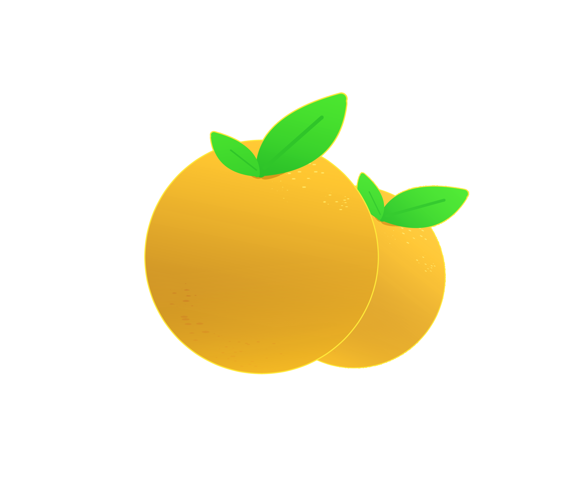

<div id="top"></div>


<!-- PROJECT SHIELDS -->
[![Contributors][contributors-shield]][contributors-url]
[![Forks][forks-shield]][forks-url]
[![Stargazers][stars-shield]][stars-url]
[![Issues][issues-shield]][issues-url]
[![MIT License][license-shield]][license-url]
[![LinkedIn][linkedin-shield]][linkedin-url]


<!-- PROJECT LOGO -->
<br />
<div align="center">
  <a href="https://github.com/JesterSnek/OPG">
    
  </a>

<h3 align="center">OPG</h3>

  <p align="center">
    OPG is a fullstack web application built with scalability in mind. PUG templates pull data from an online hosted database and the web site is therefore rendered out of them. With the project's RESTful API it is possible to register as an user, order fruits from a plot of land of your choosing, review that same plot, and much more!
    <br />
    <a href="https://documenter.getpostman.com/view/11348697/UVRAJSzH"><strong>Explore the API docs »</strong></a>
    <br />
    <br />
    <a href="https://opg-vistica.herokuapp.com/plot/bare">View Deployed App</a>
    ·
    <a href="https://github.com/JesterSnek/OPG/issues">Report Bug</a>
    ·
    <a href="https://github.com/JesterSnek/OPG/issues">Request Feature</a>
  </p>
</div>


<!-- TABLE OF CONTENTS -->
<details>
  <summary>Table of Contents</summary>
  <ol>
    <li>
      <a href="#built-with">Built With</a>
    </li>
    <li>
      <a href="#getting-started">Getting Started</a>
      <ul>
        <li><a href="#prerequisites">Prerequisites</a></li>
        <li><a href="#installation">Installation</a></li>
      </ul>
    </li>
    <li><a href="#roadmap">Roadmap</a></li>
    <li><a href="#contributing">Contributing</a></li>
    <li><a href="#license">License</a></li>
    <li><a href="#contact">Contact</a></li>
    <li><a href="#acknowledgments">Acknowledgments</a></li>
  </ol>
</details>


### Built With

* [Node.js](https://nodejs.org/en/)
* [Express](https://expressjs.com/)
* [Mongoose](https://mongoosejs.com/)
* [Pug](https://github.com/pugjs/pug)


<p align="right">(<a href="#top">back to top</a>)</p>


<!-- GETTING STARTED -->
## Getting Started

To get a local copy up and running follow these steps.

### Prerequisites

* npm
  ```sh
  npm install npm@latest -g
  ```

### Installation

1. Clone the repo
   ```sh
   git clone https://github.com/JesterSnek/OPG.git
   ```
2. Install NPM packages
   ```sh
   npm install
   ```
3. Create an ".env" file in the repo root folder and follow the .env.example file to add config variables. 
   ```js
   NODE_ENV=development    //Set it to development
   PORT=8000               //Set it to 8000
   DATABASE_PASSWORD=xxxx  //The mongoDB database password
   DATABASE=xxxx           //The mongoDB database link, example: mongodb+srv://jestersnek:<PASSWORD>@cluster0.p2nnz.mongodb.net/opg?retryWrites=true&w=majority

   JWT_SECRET=xxxx         //The secret for the JSON Web Token should be at least 32 characters long.
   JWT_EXPIRE=xxxx         //Duration in hours for the signToken util, example: JWT_EXPIRE=10h
   JWT_COOKIE_EXPIRE=xxxx  //Set it to the number of days you wish the JWT in the cookie to be valid for.

   EMAIL_USERNAME=xxxx     //This and the 3 entries below are Mailtrap specific. Get them from https://mailtrap.io/
   EMAIL_PASSWORD=xxxx
   EMAIL_HOST=xxxx
   EMAIL_PORT=xxxx

   EMAIL_FROM=xxxx         //Mailgun and Mailtrap's sent emails will have this email as the sender

   MAILGUN_USERNAME=xxxx   //Self-explanatory
   MAILGUN_PASSWORD=xxxx   //Self-explanatory

   STRIPE_SECRET_KEY=xxxx  //Self-explanatory
   ```

<p align="right">(<a href="#top">back to top</a>)</p>


<!-- ROADMAP -->
## Roadmap

- [ ] Adding a My Reviews page


See the [open issues](https://github.com/JesterSnek/OPG/issues) for a full list of proposed features (and known issues).

<p align="right">(<a href="#top">back to top</a>)</p>


<!-- CONTRIBUTING -->
## Contributing

Contributions are what make the open source community such an amazing place to learn, inspire, and create. Any contributions you make are **greatly appreciated**.

If you have a suggestion that would make this better, please fork the repo and create a pull request. You can also simply open an issue with the tag "enhancement".
Don't forget to give the project a star! Thanks again!

1. Fork the Project
2. Create your Feature Branch (`git checkout -b feature/AmazingFeature`)
3. Commit your Changes (`git commit -m 'Add some AmazingFeature'`)
4. Push to the Branch (`git push origin feature/AmazingFeature`)
5. Open a Pull Request

<p align="right">(<a href="#top">back to top</a>)</p>


<!-- LICENSE -->
## License

Distributed under the GNU License. See `LICENSE.txt` for more information.

<p align="right">(<a href="#top">back to top</a>)</p>


<!-- CONTACT -->
## Contact

Josip Vištica - josip.vistica00@gmail.com

Project Link: [https://github.com/JesterSnek/OPG](https://github.com/JesterSnek/OPG)

<p align="right">(<a href="#top">back to top</a>)</p>


<!-- ACKNOWLEDGMENTS -->
## Acknowledgments

List of resources that greatly helped me in building this Project, in addition to the documentation of the technologies that I used.

* [Choose an Open Source License](https://choosealicense.com)
* [Jonas Schmedtmann - Online Teacher](https://www.udemy.com/user/jonasschmedtmann/)

<p align="right">(<a href="#top">back to top</a>)</p>


<!-- MARKDOWN LINKS & IMAGES -->
<!-- https://www.markdownguide.org/basic-syntax/#reference-style-links -->
[contributors-shield]: https://img.shields.io/github/contributors/jestersnek/OPG.svg?style=for-the-badge
[contributors-url]: https://github.com/JesterSnek/OPG/graphs/contributors
[forks-shield]: https://img.shields.io/github/forks/jestersnek/OPG.svg?style=for-the-badge
[forks-url]: https://github.com/JesterSnek/OPG/network/members
[stars-shield]: https://img.shields.io/github/stars/JesterSnek/OPG.svg?style=for-the-badge
[stars-url]: https://github.com/JesterSnek/OPG/stargazers
[issues-shield]: https://img.shields.io/github/issues/JesterSnek/OPG.svg?style=for-the-badge
[issues-url]: https://github.com/JesterSnek/OPG/issues
[license-shield]: https://img.shields.io/github/license/JesterSnek/OPG.svg?style=for-the-badge
[license-url]: https://github.com/JesterSnek/OPG/blob/master/LICENSE.txt
[linkedin-shield]: https://img.shields.io/badge/-LinkedIn-black.svg?style=for-the-badge&logo=linkedin&colorB=555
[linkedin-url]: https://linkedin.com/in/linkedin_username
[product-screenshot]: images/screenshot.png
